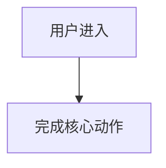

# 产品需求文档

## 1. 产品目标

### 1.1 要解决的问题

### 1.2 不解决会怎样

### 1.3 为什么现在做

## 2. 范围

### 2.1 In Scope

- 

### 2.2 Not In Scope

- 不做：  
  理由：

## 3. 用户故事

| 编号 | 用户故事 | 优先级 | 验收方式 |
|---|---|---|---|
| US-001 | 作为...我希望...以便... | P0 / P1 / P2 |  |

## 4. 关键流程

## 5. 成功指标

| 指标 | 口径 | 目标 | 验证方式 |
|---|---|---|---|
|  |  |  |  |

## 6. 风险

| 风险 | 影响 | 预案 |
|---|---|---|
|  |  |  |

