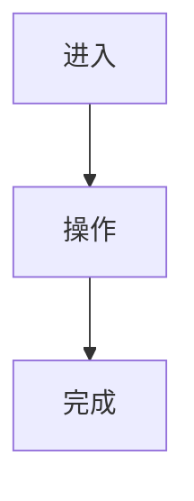

# UX 文档

## 1. 信息架构

```text
应用
└── 页面 / 模块
```

## 2. 用户流

### 2.1 核心路径



### 2.2 异常路径

| 场景 | 用户看到什么 | 用户能做什么 |
|---|---|---|
|  |  |  |

## 3. 页面地图

| 页面 | 入口 | 目标 | 涉及迭代 |
|---|---|---|---|
|  |  |  |  |

## 4. 全局状态规则

| 状态 | 规则 |
|---|---|
| 加载中 |  |
| 空数据 |  |
| 错误 |  |
| 无权限 |  |
| 移动端 |  |

## 5. 全局文案原则

- 

