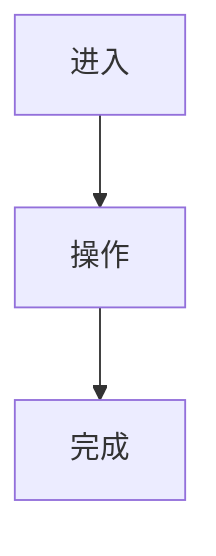

# UX 文档

## 1. 信息架构

```text
应用
└── 页面 / 模块
```

## 2. 用户流

### 2.1 核心路径



### 2.2 异常路径

| 场景 | 用户看到什么 | 用户能做什么 |
|---|---|---|
|  |  |  |

## 3. 页面地图

| 页面 | 入口 | 目标 | 涉及迭代 |
|---|---|---|---|
|  |  |  |  |

## 4. 全局状态规则

| 状态 | 规则 |
|---|---|
| 加载中 |  |
| 空数据 |  |
| 错误 |  |
| 无权限 |  |
| 移动端 |  |

## 5. 全局文案原则

- 

## 6. 阶段研究与核验

| 事实 / 假设 | 来源 / 证据 | 状态 | 影响 |
|---|---|---|---|
|  |  | confirmed / needs-check / rejected |  |

## 7. 专家增强记录

| 专家 / 工具 | 模式 | 状态 | 采纳内容 / 跳过原因 |
|---|---|---|---|
| solo-spec-ux | co-create / generate-assets / review | used / skipped / unavailable / external-adapter |  |

## 8. UX 门禁确认

- 需要用户确认的问题：
- 是否覆盖关键路径和异常路径：
- 是否明确无 UI / 有 UI 的适用范围：
- 结论：
