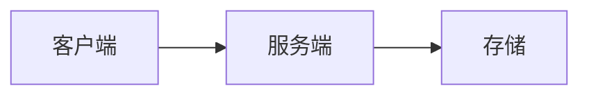

# 技术架构

## 1. 技术栈

| 层 | 选择 | 版本 / 来源 | 理由 |
|---|---|---|---|
| 前端 |  |  |  |
| 后端 |  |  |  |
| 数据库 |  |  |  |
| 部署 |  |  |  |

## 2. 目录约定

```text
项目根目录/
└── src/
```

## 3. 模块边界

| 模块 | 职责 | 不负责 | 依赖 |
|---|---|---|---|
|  |  |  |  |

## 4. 数据流



## 5. 数据模型

| 实体 / 表 | 关键字段 | 约束 | 说明 |
|---|---|---|---|
|  |  |  |  |

## 6. 接口约定

| 方法 | 路径 / 名称 | 入参 | 出参 | 说明 |
|---|---|---|---|---|
|  |  |  |  |

## 7. 外部依赖

| 依赖 | 用途 | 风险 | 降级策略 |
|---|---|---|---|
|  |  |  |  |

## 8. ADR 索引

| ADR | 决策 | 状态 |
|---|---|---|
|  |  | proposed / accepted / superseded |

