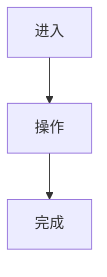

# NNN 迭代名称 · 设计

> 无 UI 的迭代保留本文件，并在相关章节写“不适用”。

## 1. UX 目标

- 

## 2. 页面 / 组件清单

| 页面 / 组件 | 新增 / 修改 | 入口 | 说明 |
|---|---|---|---|
|  |  |  |  |

## 3. 用户流

## 4. 设计产物

| 类型 | 路径 | 适用页面 / 状态 | 说明 |
|---|---|---|---|
| 线稿 | assets/wireframes/ |  |  |
| 高保真 | assets/mockups/ |  |  |
| 参考 | assets/references/ |  |  |

## 5. 状态规划

| 状态 | 设计规则 | 验收点 |
|---|---|---|
| 默认 |  |  |
| 加载中 |  |  |
| 空数据 |  |  |
| 错误 |  |  |
| 无权限 |  |  |
| 移动端 |  |  |

## 6. 文案

| 位置 | 文案 | 备注 |
|---|---|---|
|  |  |  |

## 7. 新增设计系统内容

| 类型 | Token / 组件 | 是否同步到 project/design-system.md |
|---|---|---|
|  |  | 是 / 否 |

## 8. UI 门禁

- 是否需要用户确认：
- 确认内容：
- 结论：

